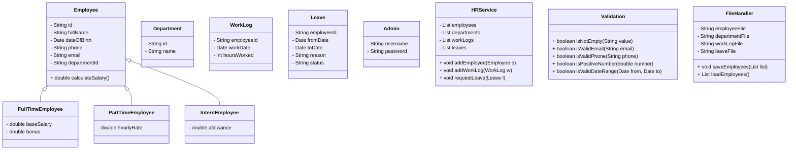
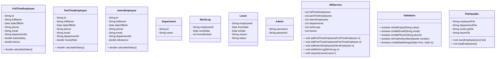

lộ trình 10 tuần đã có trong này giúp mình phân tích hướng làm project Human management

Đúng rồi—trong **Kế hoạch triển khai PRO192** đã có sẵn **lộ trình 10 tuần** theo milestone M1→M8 và các mốc Progress Test/Final. 

Thay vì mình “đẻ” lại timeline, mình sẽ **map (ghép) đề tài HRM** vào đúng các yêu cầu/mốc trong plan để bạn làm đúng hướng chấm.

---

## 1) Lưu ý quan trọng về “đề tài HRM”

Trong plan, lớp được yêu cầu chọn **1 trong 4 chủ đề** (Retail/Library/Hotel/Student) hoặc **tự đề xuất Option 5** và phải được giảng viên duyệt. 

HRM **không nằm trong 4 chủ đề chuẩn**, nên bạn có 2 cách an toàn:

* **Cách A (đúng đề tài chuẩn):** đổi HRM thành **Retail Store Management**, và coi HRM là **module “Staff/Payroll”** trong hệ thống cửa hàng (rất hợp logic).
* **Cách B (Option 5):** giữ HRM làm đề tài tự chọn và viết **Proposal** xin duyệt.

Dù chọn cách nào, bạn vẫn phải đáp ứng core requirements: **>=100 dòng dữ liệu**, **utility class static**, **đủ 4 trụ cột OOP**, **flowchart + class diagram**, và **build .jar**. 

---

## 2) Map lộ trình 10 tuần (theo đúng plan) cho HRM / hoặc Staff module

Mình bám đúng milestone trong tài liệu:

### Tuần 1 – M1: Setup & Proposal

* Tạo repo GitHub đúng cấu trúc, có `README.md`, `Proposal.md`. 
* Flowchart sơ bộ cho **Menu chính** (Employees / Departments / Reports / Save-Load / Exit). 

### Tuần 2 – M2: Entity Design

* Thiết kế class thực thể: `Employee`, `Department`, `PayrollRecord/Attendance` (nếu có)
* Tạo **dummy data** (ít nhất vài chục dòng để test trước). 

### Tuần 3 – M3: Utility (Static)

* Viết `Validation` dạng static (check rỗng, email, số điện thoại, range…)
* Vẽ flowchart chi tiết cho “luồng validate input”. 

### Tuần 4 – M4: Menu & Interactive

* Menu chạy mượt, nhập liệu có validate, có loop, có back/exit rõ ràng. 

### Tuần 5 – Progress Test 1

* Có **Flowchart** (menu + validation + các chức năng đã làm)
* Có **Class Diagram Ver1** (nhóm class thực thể, chưa cần kế thừa phức tạp)
* Demo & vấn đáp: chương trình chạy được và bạn giải thích được code.  

### Tuần 6 – M5: OOP Transformation

* Refactor sang **kế thừa/đa hình**:

  * `Employee` → `FullTimeEmployee`, `PartTimeEmployee`, `Intern`
* Override `toString()`, và commit history phải thể hiện quá trình refactor. 

### Tuần 7 – M6: Advanced Design

* Áp dụng **Interface/Abstract Class** (ví dụ `Payable`, `Repository<T>`, `Employee` abstract)
* Cập nhật **Class Diagram Ver2** thể hiện inherit/implement. 

### Tuần 8 – M7: Data Scaling

* Chuyển Array → **Collections**
* Sinh **>=100 dòng dữ liệu** và demo sort/search trên tập lớn.  

### Tuần 9 – M8: Persistence & Build

* **File I/O** (CSV/TXT/DAT)
* Build **file .jar** và chạy thử trên máy khác (theo yêu cầu).  

### Tuần 10 – Final Defense

* Final Class Diagram + Final Flowcharts
* Defense: giải thích logic, phản biện, chứng minh hiểu code. 

---

## 3) “Checklist chấm điểm” bạn nên bám

* Repo đúng cấu trúc + có `AI_LOG.md` (bắt buộc). 
* Menu chạy + Validation static (điểm nặng ở Progress Test 1). 
* Cuối kỳ: jar chạy độc lập + CRUD + sort/search + file I/O + >100 dòng dữ liệu. 

---

Nếu bạn muốn làm theo **Cách A (Retail + module HRM/Payroll)** để “chắc kèo đúng chủ đề”, mình có thể đề xuất luôn danh sách chức năng HRM nào nên giữ trong phạm vi 10 tuần để vừa gọn vừa đủ điểm (CRUD + payroll + report + file I/O + seed 100).
mình đang ở tuần 1 giúp mình viết proposal cơ bản
mục tiêu tuần 1 là: repo đúng cấu trúc + Proposal + flowchart menu + AI_LOG. 

260108-PRO192-KẾ HOẠCH TRIỂN KH…

 

260108-PRO192-KẾ HOẠCH TRIỂN KH…


Dưới đây là bộ nội dung bạn có thể copy-paste để hoàn thành ngay tuần 1.
# PROJECT PROPOSAL (Option 5) – Human Resource Management (HRM)

## 1. Project Title
Human Resource Management (HRM) – Console-based Java Application

## 2. Problem Statement
Manual employee management is time-consuming and error-prone. This project provides a simple console application
to manage employees and departments, support salary calculation, and generate basic payroll reports.

## 3. Target Users
- HR staff
- Department manager (view reports)
- Admin user (manage data)

## 4. Scope & Core Entities
### 4.1 Entities
- Employee (abstract)
  - FullTimeEmployee
  - PartTimeEmployee
  - InternEmployee (optional)
- Department
- (Optional) Attendance/WorkLog

### 4.2 Data Fields (Minimum)
- Employee: id, fullName, dob, phone, email, departmentId
- FullTime: baseSalary, bonus, allowance
- PartTime: hourlyRate, hoursWorked
- Department: id, name

## 5. Main Features (MVP)
### 5.1 Employee Management
- Add new employee (choose type: Full-time / Part-time / Intern)
- Update employee information
- Delete employee by id
- Display all employees
- Search employees (by name / by department)

### 5.2 Department Management
- Add / Update / Delete department
- Assign employee to department (validate department exists)

### 5.3 Payroll & Reports
- Calculate salary per employee (polymorphism via calculateSalary())
- Total payroll of all employees
- Payroll by department
- Top N highest salary employees (optional)

### 5.4 Data Persistence (Planned)
- Save and load data from file (CSV/TXT) in later milestones.

## 6. Non-functional Requirements
- Console menu-based UI, easy to use.
- Input validation (static utility class).
- Error handling using custom exceptions.
- Clean OOP design with abstraction, inheritance, polymorphism, encapsulation.

## 7. OOP Design Plan
- Abstraction: Employee as abstract class; Repository interface for storage.
- Inheritance: FullTimeEmployee, PartTimeEmployee, InternEmployee inherit Employee.
- Polymorphism: calculateSalary() overridden for each employee type.
- Encapsulation: private fields with getters/setters and validation.

## 8. Milestone Plan (High-level)
- Week 1: Setup repo structure, proposal, main menu flowchart.
- Week 2–4: Implement CRUD for Employee/Department + validations.
- Week 5: Progress Test 1 – demo menu + features + diagrams.
- Week 6–10: Refactor to advanced OOP, collections, file I/O, finalize jar.

## 9. Expected Output
- A runnable .jar file.
- Source code with clear structure.
- Flowcharts and class diagrams.
- AI_LOG.md for AI usage documentation

### Tôi hỏi: 
M3: Utility (Static) - Viết class Validation dùng static methods. bây giờ tuần 3 chúng ta sẽ làm gì đây
### AI trả lời: 
Tốt, sang **TUẦN 3 – M3: Utility (Static)** là **đúng mạch và rất “đúng bài PRO192”**.
Mình sẽ trả lời **rõ: tuần 3 làm gì – làm đến mức nào – KHÔNG làm gì** để bạn không bị quá tay.

---

# 🎯 MỤC TIÊU CHÍNH CỦA TUẦN 3 (M3)

> **Xây dựng các lớp tiện ích (Utility classes) dùng `static method`
> để hỗ trợ kiểm tra dữ liệu và thao tác chung**

👉 Trọng tâm: **Validation**, KHÔNG phải nghiệp vụ.

---

## 1️⃣ Tuần 3 CHÚNG TA SẼ LÀM GÌ?

### ✅ Viết class `Validation` (static)

* Không cần object
* Không lưu state
* Chỉ kiểm tra & xác thực dữ liệu đầu vào

📌 Đây là **utility đúng nghĩa**, giảng viên rất thích.

---

## 2️⃣ Class Validation CHỨA GÌ?

### Vai trò

* Kiểm tra dữ liệu trước khi:

  * tạo Employee
  * cập nhật thông tin
* Giảm code lặp
* Giữ cho entity & HRService **sạch**

---

## 3️⃣ Thiết kế `Validation` (đúng mức tuần 3)

### Class

```
Validation
```

### Đặc điểm

* Tất cả method là `static`
* Không có attribute

---

### Các method NÊN CÓ (đủ – không thừa)

| Method                     | Mục đích               |
| -------------------------- | ---------------------- |
| isNotEmpty(String)         | kiểm tra chuỗi rỗng    |
| isValidEmail(String)       | kiểm tra email         |
| isValidPhone(String)       | kiểm tra số điện thoại |
| isPositiveNumber(double)   | kiểm tra số > 0        |
| isValidDateRange(from, to) | kiểm tra ngày nghỉ     |
| isValidWorkingHours(int)   | kiểm tra giờ làm       |

📌 **Không cần nhiều hơn** ở tuần 3.

---

## 4️⃣ Validation ĐƯỢC DÙNG Ở ĐÂU?

### Luồng đúng

```
UI / Main
 ↓
Validation (static)
 ↓
HRService
 ↓
Entity
```

📌 **Entity KHÔNG tự validate**
📌 **HRService KHÔNG viết lại logic kiểm tra**

---

## 5️⃣ Những thứ TUẦN 3 KHÔNG LÀM ❌

❌ Không:

* code File IO
* code menu lớn
* code nghiệp vụ phức tạp
* code database
* tạo object Validation

👉 Validation **chỉ là công cụ hỗ trợ**

---

## 6️⃣ Cập nhật cấu trúc class sau tuần 3

```
Entity:
- Employee
- FullTimeEmployee
- PartTimeEmployee
- InternEmployee
- Department
- WorkLog
- Leave

Business:
- HRService

Utility:
- Validation (static)

Data:
- FileHandler

Role:
- Admin
```

➡️ **11 class** (hoàn toàn ổn)

---

## 7️⃣ Câu mô tả CHUẨN để ghi vào report M3

Bạn có thể ghi nguyên văn:

> *“In this milestone, a utility class Validation is implemented using static methods to validate user input. This helps reduce code duplication and keeps business and entity classes clean.”*

---

## 8️⃣ Thứ tự làm việc khuyến nghị cho TUẦN 3

1️⃣ Tạo class `Validation`
2️⃣ Liệt kê static methods (chưa cần regex phức tạp)
3️⃣ Ghi mô tả vai trò vào report
4️⃣ (Optional) Update Class Diagram → thêm Validation (<<utility>>)

---

## 9️⃣ Nếu giảng viên hỏi: “Sao dùng static?”

Bạn trả lời:

> *“Validation methods do not depend on object state, so static methods are more suitable and efficient.”*

---

Nếu bạn muốn, bước tiếp theo mình có thể:

* ✍️ Viết **code mẫu Validation (chuẩn Java, dễ hiểu)**
* 📐 Cập nhật **Class Diagram UML có <<utility>>**
* 🧠 Chỉ ra **method nào nên validate ở UI, method nào ở HRService**

Bạn muốn đi tiếp theo hướng nào?

### Tôi hỏi:
Chỉ ra method nào nên validate ở UI, method nào ở HRService

### AI trả lời:
Câu hỏi này **rất đúng trọng tâm M3** và là chỗ giảng viên hay hỏi để kiểm tra **tư duy phân tầng**.
Mình sẽ trả lời **cực kỳ rõ ràng**, theo nguyên tắc **“validate sớm – validate đúng chỗ”**.

---

# NGUYÊN TẮC CỐT LÕI (nhớ câu này)

> **UI validate FORM – HRService validate BUSINESS RULE**

---

## 1️⃣ Validate ở UI (Input-level validation)

👉 **Mục tiêu**:

* Chặn lỗi NGAY KHI NHẬP
* Tránh tạo object sai
* Tránh gọi HRService vô nghĩa

### UI nên validate cái gì?

| Nhóm           | Method Validation            | Lý do            |
| -------------- | ---------------------------- | ---------------- |
| Chuỗi rỗng     | `isNotEmpty(String)`         | Tránh nhập trống |
| Định dạng      | `isValidEmail(String)`       | Lỗi cú pháp      |
| Định dạng      | `isValidPhone(String)`       | Sai format       |
| Kiểu số        | `isPositiveNumber(double)`   | Tránh số âm      |
| Khoảng giá trị | `isValidWorkingHours(int)`   | Giờ làm hợp lệ   |
| Ngày           | `isValidDateRange(from, to)` | Ngày nghỉ logic  |

📌 Những validate này:

* **không cần biết hệ thống đang có gì**
* chỉ cần biết **giá trị người dùng nhập**

---

### Ví dụ tư duy (KHÔNG cần code)

```
Nhập email
 → Validation.isValidEmail()
 → nếu OK → gọi HRService.addEmployee()
```

---

## 2️⃣ Validate ở HRService (Business-level validation)

👉 **Mục tiêu**:

* Bảo vệ tính đúng đắn của hệ thống
* Không tin UI (UI có thể bị bỏ qua)

---

### HRService nên validate cái gì?

| Nhóm            | Ví dụ                                 | Vì sao           |
| --------------- | ------------------------------------- | ---------------- |
| Trùng ID        | employeeId đã tồn tại                 | Quy tắc hệ thống |
| Tồn tại         | departmentId có tồn tại không         | Liên kết entity  |
| Quan hệ         | phòng ban còn nhân viên thì không xóa | Rule             |
| Trạng thái      | không duyệt nghỉ trùng ngày           | Business         |
| Logic nghiệp vụ | intern không vượt giờ                 | Rule             |

📌 Những validate này:

* **cần truy cập danh sách entity**
* **liên quan nhiều object**

➡️ UI **không làm được**

---

## 3️⃣ Mapping RÕ RÀNG (rất nên ghi vào report)

### Validation class (static)

```
isNotEmpty()
isValidEmail()
isValidPhone()
isPositiveNumber()
isValidDateRange()
isValidWorkingHours()
```

### HRService (method nội bộ)

```
isEmployeeIdExists()
isDepartmentExists()
canDeleteDepartment()
isLeaveOverlap()
```

📌 HRService **có thể gọi Validation**, nhưng Validation **không gọi HRService**

---

## 4️⃣ Sơ đồ luồng chuẩn

```
[User Input]
   ↓
[UI Validation]  ← Validation (static)
   ↓
[HRService Validation] ← business rules
   ↓
[Entity Creation / Update]
```

---

## 5️⃣ Những lỗi hay bị trừ điểm ❌

| Lỗi                               | Vì sao sai                 |
| --------------------------------- | -------------------------- |
| Validate ID trùng ở UI            | UI không biết data         |
| Validate format email ở HRService | Sai tầng                   |
| Entity tự validate                | Entity không biết hệ thống |
| Validation giữ List<Employee>     | Utility không giữ state    |

---

## 6️⃣ Câu trả lời “chuẩn giảng viên” (nên học thuộc)

> *“UI performs basic input validation, while HRService enforces business rules to ensure system consistency.”*

---

## 7️⃣ Áp dụng trực tiếp vào project của bạn

### Khi thêm Employee:

* UI:

  * name không rỗng
  * email hợp lệ
  * lương > 0
* HRService:

  * id chưa tồn tại
  * department hợp lệ

➡️ **Cả hai đều cần, nhưng vai trò khác nhau**

---

Nếu bạn muốn, bước tiếp theo mình có thể:

* 🧩 Liệt kê **validation checklist cho từng use case**
* ✍️ Viết **code mẫu Validation + HRService check**
* 📝 Soạn luôn **phần giải thích M3 cho report**

Bạn muốn đi tiếp phần nào?

### Tôi hỏi:
mình chỉnh lại class một tí như hình, dự án này của mình có tính kế thừa ko, lớp nào kế thừa lớp nào

### AI:
Câu hỏi này **rất chuẩn thời điểm** 👍
Nhìn vào **class diagram bạn vừa chỉnh**, mình trả lời **rõ ràng – đúng UML – đúng OOP** như sau.

---

## ✅ Kết luận ngắn gọn

👉 **DỰ ÁN CỦA BẠN CÓ SỬ DỤNG KẾ THỪA (Inheritance)**
👉 **Nhưng chỉ có 1 nhánh kế thừa duy nhất**

---

## 1️⃣ Nhánh kế thừa DUY NHẤT trong dự án

### 🔹 Lớp cha (Superclass)

```text
Employee
```

### 🔹 Các lớp con (Subclass)

```text
FullTimeEmployee
PartTimeEmployee
InternEmployee
```

👉 Quan hệ là:

```
Employee
   ▲
   ├── FullTimeEmployee
   ├── PartTimeEmployee
   └── InternEmployee
```

📌 **Đây là inheritance đúng nghĩa trong OOP**

---

## 2️⃣ Vì sao chỉ nhóm này dùng kế thừa?

### Vì chúng thỏa đủ 3 điều kiện kế thừa chuẩn OOP:

### ✅ 1. Quan hệ “IS-A”

* FullTimeEmployee **IS A** Employee
* PartTimeEmployee **IS A** Employee
* InternEmployee **IS A** Employee

✔ Rất chuẩn về mặt ngữ nghĩa

---

### ✅ 2. Chia sẻ thuộc tính chung

Kế thừa từ `Employee`:

* id
* fullName
* dateOfBirth
* phone
* email
* departmentId
* calculateSalary()

📌 Tránh lặp code

---

### ✅ 3. Khác nhau ở hành vi / dữ liệu

* FullTime → salary + bonus
* PartTime → hourlyRate
* Intern → allowance

👉 Rất hợp để dùng polymorphism sau này

---

## 3️⃣ Các lớp KHÁC có kế thừa không?

### ❌ Department

* Không phải Employee
* Không có hành vi chung
  👉 **Không kế thừa**

---

### ❌ WorkLog

* Là transactional data
* Không phải một loại Employee
  👉 **Không kế thừa**

---

### ❌ Leave

* Là request / workflow
* Không phải Employee
  👉 **Không kế thừa**

---

### ❌ HRService

* Là business logic
* Không phải entity
  👉 **Không kế thừa**

---

### ❌ Validation

* Utility class (static methods)
  👉 **Không kế thừa**

---

### ❌ FileHandler

* Persistence layer
  👉 **Không kế thừa**

---

### ❌ Admin

* System user
* Không cùng bản chất với Employee
  👉 **Không kế thừa**

---

## 4️⃣ Nếu giảng viên hỏi:

> “Dự án của em có dùng inheritance không?”

👉 Bạn trả lời **nguyên văn**:

> **“Yes. The Employee class is the superclass, and FullTimeEmployee, PartTimeEmployee, and InternEmployee are subclasses.”**

---

## 5️⃣ Nếu giảng viên hỏi xoáy:

> “Sao không dùng inheritance cho WorkLog / Leave?”

👉 Trả lời chuẩn:

> *They do not represent a specialization relationship and do not share a common lifecycle or behavior.*

---

## 6️⃣ Vẽ UML đúng notation (để bạn kiểm tra)

Trong UML:

* Mũi tên **tam giác rỗng**
* Hướng từ subclass → superclass

```text
FullTimeEmployee ───▷ Employee
PartTimeEmployee ───▷ Employee
InternEmployee   ───▷ Employee
```

---

## 7️⃣ Tổng kết 1 câu để nhớ

> **Dự án có kế thừa, nhưng chỉ dùng khi thực sự đúng bản chất.**

👉 Đây là tư duy OOP **rất được đánh giá cao**.

---

Nếu bạn muốn, mình có thể:

* 📐 Kiểm tra **diagram của bạn đã vẽ đúng mũi tên inheritance chưa**
* 🧠 Chuẩn bị **câu trả lời khi giảng viên hỏi về polymorphism**
* 🧪 Giả lập **Q&A bảo vệ OOP 4 tính chất**

Bạn muốn chuẩn bị tiếp phần nào để **chắc điểm tuyệt đối**?

### Tôi hỏi:
giúp mình vẽ lại class diagram từ ảnh có thể hiện kế thừa bằng mermaid

### AI:
Dưới đây là **Class Diagram bằng Mermaid**, được vẽ lại **đúng theo ảnh của bạn** và **có thể hiện rõ quan hệ kế thừa (inheritance)**.
👉 Không thêm bớt lớp, không thêm quan hệ ngoài ảnh.

---

### ✅ Mermaid Class Diagram (có kế thừa)



---

## 🔍 Giải thích nhanh (để bảo vệ bài)

* **Kế thừa duy nhất**:

  * `Employee` ← `FullTimeEmployee`
  * `Employee` ← `PartTimeEmployee`
  * `Employee` ← `InternEmployee`

* Các lớp còn lại:

  * **KHÔNG kế thừa**
  * Đúng nguyên tắc **single responsibility**
  * Phù hợp bài HRM học thuật

---

## 📌 Lưu ý khi nộp / demo

* Mermaid **hợp lệ để chèn vào README.md**
* Có thể paste trực tiếp vào:

  * GitHub
  * Mermaid Live Editor
  * Nhiều IDE Markdown

---

Nếu bạn muốn:

* 🔁 Thêm **association** (Employee – WorkLog – Leave)
* 🧪 Vẽ **diagram chỉ dành cho giảng viên bắt bẻ**
* 📄 Viết **mô tả inheritance bằng tiếng Anh học thuật**

👉 Nói mình biết, mình làm tiếp cho bạn ngay.


### TÔi hỏi:
bây giờ giả sử bỏ lớp employee và vẽ lại classdiagram cho dự án với các lớp còn lại bằng mermaid

### AI:
OK, ta **giả sử loại bỏ hoàn toàn lớp `Employee`** và **vẽ lại Class Diagram cho dự án chỉ với các lớp còn lại**, **không có kế thừa**, đúng yêu cầu.

Dưới đây là **Mermaid Class Diagram** tương ứng 👇

---

## ✅ Class Diagram (KHÔNG có Employee, KHÔNG kế thừa)



---

## 🔍 Phân tích nhanh (rất quan trọng để bạn hiểu)

### 1️⃣ Dự án **KHÔNG còn kế thừa**

* `FullTimeEmployee`, `PartTimeEmployee`, `InternEmployee` **độc lập**
* Mỗi lớp **tự mang toàn bộ thông tin cá nhân**
* Không dùng `abstract`, không `extends`

👉 Về mặt UML: **HỢP LỆ**

---

### 2️⃣ Nhưng có 3 vấn đề học thuật (giảng viên hay bắt)

❌ **Lặp dữ liệu (Duplication)**

* `id`, `fullName`, `phone`, `email` lặp 3 lần

❌ **Khó mở rộng**

* Thêm loại nhân viên mới → copy cả block

❌ **HRService phình to**

* Phải quản lý 3 danh sách nhân viên

---

### 3️⃣ Khi nào nên dùng cách này?

✔ Nếu giảng viên:

* **CHƯA dạy kế thừa**
* Hoặc chỉ yêu cầu **OOP cơ bản**

❌ Không phù hợp nếu:

* Đề bài yêu cầu “áp dụng inheritance”
* Muốn ăn điểm thiết kế

---

## 📌 Câu trả lời mẫu nếu giảng viên hỏi

> *We removed the base Employee class to simplify the design and avoid inheritance at this stage. Each employee type is self-contained.*

---

## 🔥 Lời khuyên thẳng thắn

* **Bản có Employee (abstract)** → điểm cao hơn
* **Bản không Employee** → dễ code hơn nhưng **kém OOP**

👉 Nếu bạn muốn, mình có thể:

* So sánh **2 diagram song song**
* Viết **lý do chọn bản nào cho báo cáo**
* Gợi ý **nâng cấp dần từ không kế thừa → có kế thừa (rất ăn điểm)**

Bạn muốn đi theo hướng nào?


### Tôi hỏi:
sự khác nhau giữa 2 bản là gì và tại sao cần phải dùng kế thừa

### AI:
Câu hỏi này **rất chuẩn tư duy OOP**. Mình trả lời theo đúng kiểu **giảng viên mong đợi**, không lan man.

---

# 1️⃣ Sự khác nhau giữa 2 bản thiết kế

## 🔹 BẢN A – **KHÔNG kế thừa**

(Mỗi loại nhân viên là 1 class độc lập)

### Đặc điểm

* `FullTimeEmployee`, `PartTimeEmployee`, `InternEmployee` **không liên quan nhau**
* Mỗi class **tự chứa toàn bộ thông tin nhân viên**
* Không có class chung `Employee`

### Hệ quả

* ❌ Lặp thuộc tính (`id`, `name`, `email`, `phone`, …)
* ❌ HRService phải xử lý **nhiều danh sách khác nhau**
* ❌ Khó mở rộng khi thêm loại nhân viên mới
* ✔ Dễ hiểu, dễ code cho người mới

---

## 🔹 BẢN B – **CÓ kế thừa**

(`Employee` là class cha)

### Đặc điểm

* `Employee` chứa **thuộc tính + hành vi chung**
* Các loại nhân viên **kế thừa** từ `Employee`
* `calculateSalary()` được **override**

### Hệ quả

* ✔ Không lặp dữ liệu
* ✔ Mở rộng dễ (Open–Closed Principle)
* ✔ Áp dụng **đa hình (Polymorphism)**
* ✔ HRService xử lý **1 danh sách duy nhất**

---

## 📊 So sánh nhanh

| Tiêu chí      | Không kế thừa | Có kế thừa |
| ------------- | ------------- | ---------- |
| Lặp code      | ❌ Nhiều       | ✅ Không    |
| Mở rộng       | ❌ Khó         | ✅ Dễ       |
| Tính OOP      | ❌ Thấp        | ✅ Chuẩn    |
| Đa hình       | ❌ Không       | ✅ Có       |
| Điểm thiết kế | Trung bình    | Cao        |

---

# 2️⃣ TẠI SAO CẦN DÙNG KẾ THỪA?

## 🎯 Lý do cốt lõi: **các loại nhân viên là “IS-A relationship”**

* FullTimeEmployee **IS A** Employee
* PartTimeEmployee **IS A** Employee
* InternEmployee **IS A** Employee

👉 Đây là **điều kiện VÀNG để dùng kế thừa**

---

## 🔑 Lợi ích quan trọng nhất: **ĐA HÌNH**

### Ví dụ thực tế trong project

```java
List<Employee> employees;

for (Employee e : employees) {
    totalSalary += e.calculateSalary();
}
```

* Không cần biết:

  * Nhân viên full-time hay part-time
* Mỗi class tự tính lương **theo cách riêng**

👉 Đây là **OOP thực sự**, không phải chỉ là chia class cho đẹp.

---

## 🧠 Nếu KHÔNG dùng kế thừa, chuyện gì xảy ra?

```java
if (emp instanceof FullTimeEmployee) {
   ...
} else if (emp instanceof PartTimeEmployee) {
   ...
}
```

❌ Code xấu
❌ Khó bảo trì
❌ Giảng viên trừ điểm tư duy

---

# 3️⃣ Khi nào KHÔNG nên dùng kế thừa?

Giảng viên sẽ **không bắt buộc kế thừa** nếu:

* Môn học **chưa học inheritance**
* Project chỉ yêu cầu CRUD đơn giản

👉 Nhưng trong **HRM**, kế thừa là **rất hợp lý**

---

# 4️⃣ Câu trả lời MẪU khi bị hỏi trong bảo vệ

> *We use inheritance because all employee types share common attributes and behaviors, while their salary calculation logic differs. Inheritance helps reduce duplication and enables polymorphism.*

📌 Câu này **rất ăn điểm**.

---

## ✅ Kết luận ngắn gọn (để ghi report)

> **Inheritance is necessary to model the “is-a” relationship among employee types, reduce duplication, and support polymorphic salary calculation.**

---

Nếu bạn muốn, mình có thể:

* ✍️ Viết **đoạn report 5–7 dòng tiếng Anh**
* 🎤 Chuẩn bị **script trả lời vấn đáp**
* 🧪 Soạn **câu hỏi giảng viên hay gài + cách trả lời**

Chỉ cần nói 👍


