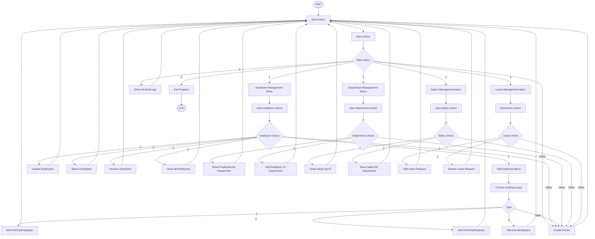

```mermaid
flowchart TD

A([Start]) --> B[Show Menu]
B --> C[Input choice]

C --> D{Main choice}

D -->|1| E[Employee Management Menu]
D -->|2| F[Department Management Menu]
D -->|3| G[Salary Management Menu]
D -->|4| H[Leave Management Menu]
D -->|5| WL[Show All WorkLogs]
D -->|6| Z[Exit Program]
D -->|Other| X[Invalid Choice]

%% EMPLOYEE MENU
E --> E1[Input employee choice]
E1 --> E2{Employee choice}

E2 -->|1| AE[Add Employee Menu]
E2 -->|2| UE[Update Employees]
E2 -->|3| SE[Search Employee]
E2 -->|4| RE[Remove Employee]
E2 -->|5| SAE[Show All Employees]
E2 -->|Other| X

%% Add Employee Menu
AE --> AE1[Choose employee type]
AE1 --> AE2{Type}

AE2 -->|1| FT[Add FullTimeEmployee]
AE2 -->|2| PT[Add PartTimeEmployee]
AE2 -->|3| IN[Add InternEmployee]
AE2 -->|Other| X

%% DEPARTMENT MENU
F --> F1[Input department choice]
F1 --> F2{Department choice}

F2 -->|1| SED[Show Employees By Department]
F2 -->|2| AED[Add Employee To Department]
F2 -->|Other| X

%% SALARY MENU
G --> G1[Input salary choice]
G1 --> G2{Salary choice}

G2 -->|1| SSID[Show Salary By ID]
G2 -->|2| SSD[Show Salary By Department]
G2 -->|Other| X

%% LEAVE MENU
H --> H1[Input leave choice]
H1 --> H2{Leave choice}

H2 -->|1| LRQ[Add Leave Request]
H2 -->|2| RRQ[Review Leave Request]
H2 -->|Other| X

%% LOOP BACK
UE --> B
SE --> B
RE --> B
SAE --> B
FT --> B
PT --> B
IN --> B
SED --> B
AED --> B
SSID --> B
SSD --> B
LRQ --> B
RRQ --> B
WL --> B
X --> B

Z --> Y([End])
```
