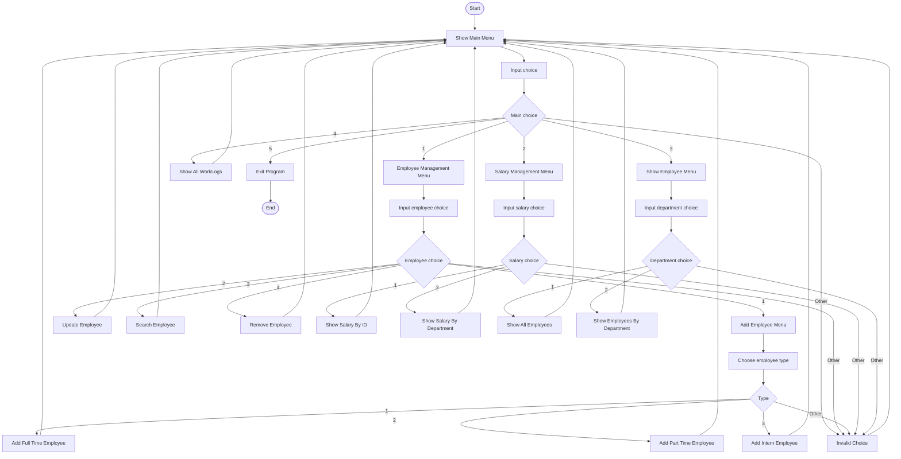

```mermaid
flowchart TD

A([Start]) --> B[Show Main Menu]
B --> C[Input choice]

C --> D{Main choice}

D -->|1| E[Employee Management Menu]
D -->|2| F[Salary Management Menu]
D -->|3| G[Show Employee Menu]
D -->|4| H[Show All WorkLogs]
D -->|5| Z[Exit Program]
D -->|Other| X[Invalid Choice]

%% Employee Menu
E --> E1[Input employee choice]
E1 --> E2{Employee choice}
E2 -->|1| AE[Add Employee Menu]
E2 -->|2| UE[Update Employee]
E2 -->|3| SE[Search Employee]
E2 -->|4| RE[Remove Employee]
E2 -->|Other| X

%% Add Employee Menu
AE --> AE1[Choose employee type]
AE1 --> AE2{Type}
AE2 -->|1| FT[Add Full Time Employee]
AE2 -->|2| PT[Add Part Time Employee]
AE2 -->|3| IN[Add Intern Employee]
AE2 -->|Other| X

%% Salary Menu
F --> F1[Input salary choice]
F1 --> F2{Salary choice}
F2 -->|1| SSID[Show Salary By ID]
F2 -->|2| SSD[Show Salary By Department]
F2 -->|Other| X

%% Show Employee Menu
G --> G1[Input department choice]
G1 --> G2{Department choice}
G2 -->|1| SAE[Show All Employees]
G2 -->|2| SED[Show Employees By Department]
G2 -->|Other| X

%% Loop back
UE --> B
SE --> B
RE --> B
FT --> B
PT --> B
IN --> B
SSID --> B
SSD --> B
SAE --> B
SED --> B
H --> B
X --> B

Z --> Y([End])
```
